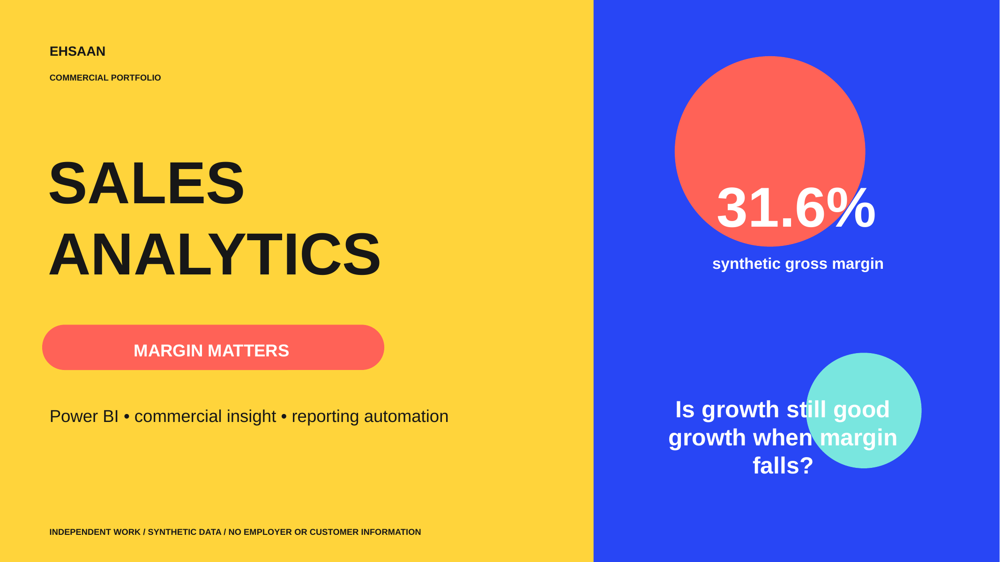

# Sales Analytics Case Study

## Sales Growth, Margin Quality and Commercial Decision-Making

This independent portfolio project examines whether revenue growth is translating into profitable growth—and where pricing, promotion or returns activity should change.

[**View the complete Sales Analytics case study (PDF)**](Ehsaan-Khan-Sales-Analytics-Case-Study.pdf)

> **Portfolio disclosure:** This project uses entirely synthetic data and contains no employer or customer information. Financial benefits are illustrative planning scenarios, not realised outcomes.

## Technical Project Layer

This repository includes both SQL and Python so a reviewer can inspect the full analytical workflow rather than only the final presentation.

- `data/generate_sales_data.py` — creates 15,840 reproducible synthetic orders.
- `sql/analysis.sql` — calculates headline KPIs, channel economics, year-on-year movement, segment contribution and discount leakage.
- `python/sales_analysis.py` — validates the data, builds channel and priority-segment summaries, and produces simple analytical charts.
- `requirements.txt` — Python dependencies.
- `outputs/` is created automatically when the Python analysis runs.

The generated dataset produces approximately £8.9m net sales, ~31% gross margin and ~5% returns. The intended weak segment—Marketplace → Audio Accessories → North—shows materially lower margin and higher returns than the portfolio average.

## Business Question

**Which channels are generating revenue without converting it into margin, and where should pricing or promotional activity change?**

The intended audience is sales leadership, commercial finance and channel owners.

## Techniques Demonstrated

### SQL
- KPI aggregation
- Common table expressions
- Contribution analysis using portfolio totals
- Margin and return-rate calculations
- Segment ranking
- Discount-floor exception analysis

### Python
- `pandas` data loading and transformation
- Validation assertions
- Grouped commercial analysis
- Reusable KPI calculations
- CSV output generation
- `matplotlib` visualisation

## Key Business Finding

The analysis identifies the North marketplace audio-accessories segment as a case where discount-led sales growth is producing disproportionately weak gross-profit contribution and elevated returns. This suggests that the next action should be commercial and operational—not simply pursuing more volume.

## Recommended Business Response

1. Introduce and monitor a minimum margin floor.
2. Investigate product-listing and returns drivers.
3. Review discount exceptions before approving additional promotions.
4. Correct operational causes of returns before purchasing further growth.
5. Track sales, margin, returns and gross-profit contribution together.

## How to Run

1. Install dependencies with `pip install -r requirements.txt`.
2. Run `python data/generate_sales_data.py`.
3. Run `python python/sales_analysis.py`.
4. Inspect generated files in `outputs/`.
5. Import the CSV into SQLite if you want to run `sql/analysis.sql`.

## Working Style

I use AI assistance where appropriate to accelerate technical implementation, while retaining ownership of the business question, analytical logic, validation, interpretation and communication of results.

**Find the commercial tension → Validate the data → Analyse the driver → Quantify the trade-off → Recommend the next test**
